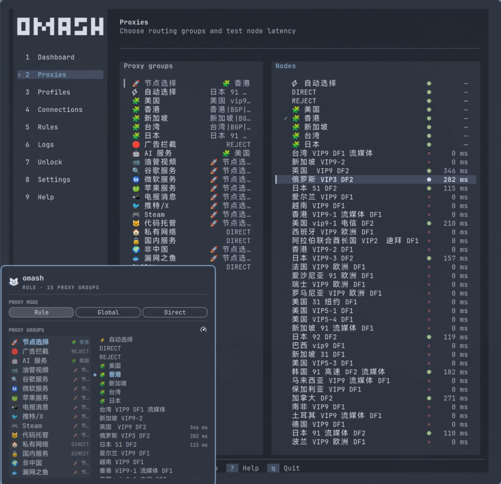
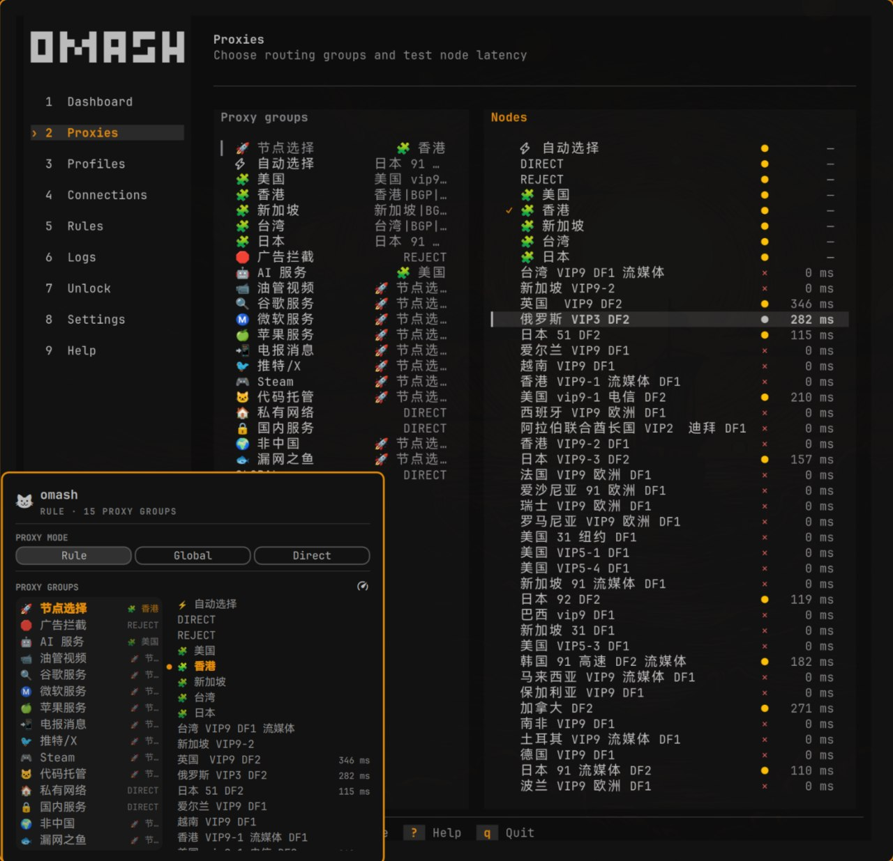

```text
 ██████╗ ███╗   ███╗ █████╗ ███████╗██╗  ██╗
██╔═══██╗████╗ ████║██╔══██╗██╔════╝██║  ██║
██║   ██║██╔████╔██║███████║███████╗███████║
██║   ██║██║╚██╔╝██║██╔══██║╚════██║██╔══██║
╚██████╔╝██║ ╚═╝ ██║██║  ██║███████║██║  ██║
 ╚═════╝ ╚═╝     ╚═╝╚═╝  ╚═╝╚══════╝╚═╝  ╚═╝
```

`omash` is forked from
[Clash Verge Rev](https://github.com/clash-verge-rev/clash-verge-rev) and
reworked as a fast, native terminal dashboard for Mihomo, built for
[Omarchy](https://omarchy.org/). It carries the upstream Mihomo management
design into a Rust TUI without a browser runtime.

The TUI is only the control surface. Mihomo runs under a user-level supervisor,
so closing `omash` does not stop your proxy.

<p align="center">
  
  
</p>

## Features

- Imports local profiles and remote subscriptions, with scheduled updates
- Supports Rule, Global, and Direct modes, proxy selection, and delay tests
- Manages active connections, Merge enhancements, backups, and logs
- Uses the system Mihomo and GeoIP packages maintained by Omarchy
- Keeps Mihomo running through a user service after the TUI closes
- Updates `gsettings` and the UWSM/systemd environment for newly launched apps
- Follows the active Omarchy palette, with optional theme overrides
- Provides an optional Omarchy Shell widget for common controls

## Install

Install the system dependencies first:

```bash
omarchy pkg aur add mihomo clash-geoip

# Only needed when Cargo is not already installed:
omarchy install dev-env rust
source "$HOME/.cargo/env"
```

Install `omash`, then launch it once to finish setup:

```bash
curl -fsSL https://raw.githubusercontent.com/ourongxing/omash/main/scripts/install | bash
omash
```

The installer writes the binary and user service under your home directory; it
does not install system packages or use `sudo`. On first launch, `omash` creates
its configuration, starts the supervisor, and enables login startup because
`auto_start = true` by default.

### Install from source

After installing the dependencies above, build and install manually:

```bash
git clone https://github.com/ourongxing/omash.git
cd omash
cargo build --locked --release

install -Dm755 target/release/omash "$HOME/.local/bin/omash"
systemd_user_dir="${XDG_CONFIG_HOME:-$HOME/.config}/systemd/user"
install -Dm644 systemd/omash-supervisor.service \
  "$systemd_user_dir/omash-supervisor.service"
sed -i 's|^ExecStart=.*|ExecStart=%h/.local/bin/omash --daemon|' \
  "$systemd_user_dir/omash-supervisor.service"
systemctl --user daemon-reload

omash
```

### Optional Shell widget

The installer does not add the Omarchy Shell widget. Install it separately:

```bash
omarchy plugin add https://github.com/ourongxing/omash.git --enable
```

The widget appears immediately and supports mode changes, proxy selection, and
delay tests. It calls `omash bar` and does not access the Mihomo API secret.

### Update

From `0.1.3` or newer, rerun the installer to update in place:

```bash
curl -fsSL https://raw.githubusercontent.com/ourongxing/omash/main/scripts/install | bash
```

Versions before `0.1.3` used a system-wide `/usr` layout and must be uninstalled
first:

```bash
curl -fsSL https://raw.githubusercontent.com/ourongxing/omash/main/scripts/uninstall | bash
curl -fsSL https://raw.githubusercontent.com/ourongxing/omash/main/scripts/install | bash
```

Configuration, profiles, logs, and backups are preserved. The old-version
uninstaller removes the optional widget, so add it again after updating.

## Controls

| Key | Action |
| --- | --- |
| `1`-`8` | Open a page |
| `Up` / `Down`, `j` / `k` | Move the selection |
| `Tab`, `Left` / `Right`, `h` / `l` | Switch between proxy groups and nodes |
| `Enter` | Run the selected action |
| `r` | Refresh now |
| `?` | Toggle shortcut help |
| `q`, `Ctrl-C` | Exit the TUI without stopping Mihomo |

Press `?` for the complete shortcut list. Mouse input is also supported.

## Remove

Remove the widget, user service, binary, and legacy system files with:

```bash
curl -fsSL https://raw.githubusercontent.com/ourongxing/omash/main/scripts/uninstall | bash
```

The uninstaller preserves `~/.config/omash` and `~/.local/share/omash`, which
contain your configuration, profiles, logs, and backups. Remove those
directories manually if you also want to delete user data.

## Configuration

The main configuration file is `~/.config/omash/config.toml`. Runtime data is
stored in `~/.local/share/omash/`.

```toml
controller = "http://127.0.0.1:9090"
secret = ""
refresh_ms = 1500
delay_test_url = "https://www.gstatic.com/generate_204"
auto_start = true
mixed_port = 7897
allow_lan = false
ipv6 = true
system_proxy = true
proxy_bypass = "localhost,127.0.0.1,::1,192.168.0.0/16,10.0.0.0/8,172.16.0.0/12"
```

`OMASH_REFRESH_MS` and `--refresh-ms` override the configured refresh interval.
Use `--config <path>` to load a different configuration file.

### Theme override

The TUI follows the current Omarchy palette by default. To override it:

```bash
mkdir -p ~/.config/omash
cp themes/default.toml ~/.config/omash/theme.toml
```

Changes reload automatically. Remove the file to follow Omarchy again; available
fields are documented in [`themes/default.toml`](themes/default.toml).

## Development

```bash
cargo test
cargo build --locked --release
```

## License

As a fork of Clash Verge Rev, `omash` remains licensed under GPL-3.0-only. The
full, unmodified license is retained in [`LICENSE`](LICENSE).
